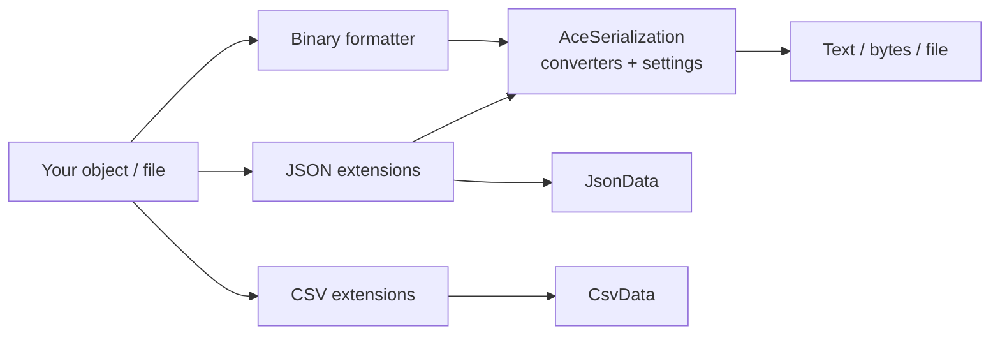

# AceLand Serialization

Turn Unity objects into JSON, CSV or binary — and back — in a single line.

## In One Line
Save it, load it, done — even your Vector3s behave.

## Overview
`AceLand.Serialization` is a standalone Unity package that makes reading and writing data effortless.
It wraps [Newtonsoft.Json](https://www.newtonsoft.com/json) with a large set of ready-made converters,
adds a `BinaryFormatter` that already knows how to handle Unity types, and gives you a tiny CSV reader —
all behind clean extension methods and safe builder objects.

The headline feature is that **Unity types just work**. `Vector2/3/4`, `Quaternion`, `Color`, `Bounds`,
`Rect`, `LayerMask`, `AnimationCurve`, `Gradient`, `Matrix4x4`, `Hash128`, their `Int` variants, and the
Unity.Mathematics `float2/3/4` (plus matrices and quaternion) are all serialized correctly out of the box —
no attributes, no custom code on your side.

## Package Info
| | |
| --- | --- |
| display name | AceLand Serialization |
| package name | com.aceland.serialization |
| latest version | 3.0.0 |
| namespace | AceLand.Serialization |
| git repository | [https://github.com/parsue/com.aceland.serialization.git](https://github.com/parsue/com.aceland.serialization.git) |
| unity | 2022.3 or newer |
| dependencies | com.unity.nuget.newtonsoft-json: 3.2.2   com.unity.mathematics: 1.3.2 |

---

## Why Use It
- **Unity types out of the box.** Serialize a `Vector3` or an `AnimationCurve` to JSON or binary without
  writing a single converter yourself.
- **One-line API.** `myData.ToJson()`, `json.ToData<T>()`, `path.ReadAsCsv()` — the extension methods read
  like plain English.
- **Standalone.** No dependency on any other AceLand package. Only Newtonsoft.Json and Unity.Mathematics,
  both official Unity packages.
- **Safe by design.** Data objects (`JsonData`, `CsvData`, `PathData`) are built through builders and never
  expose a public constructor, so you always get a valid, consistent object.
- **Async ready.** `ToJsonAsync()` / `ToDataAsync()` move heavy (de)serialization off the main thread and
  cancel automatically when the application quits.

---

## How It Works
The package is organised into four small areas that share one settings hub, `AceSerialization`:



- **JSON** uses Newtonsoft.Json with a pre-built list of `JsonConverter`s for every supported Unity type.
- **Binary** uses `BinaryFormatter` with a `SurrogateSelector` that teaches it how to write Unity structs.
- **CSV** is a lightweight reader that respects quoted fields and produces a structured `CsvData`.
- **Models** (`JsonData`, `CsvData`, `PathData`) are immutable value holders created via builders.

All the converter wiring lives in [`AceSerialization`](json.md), so every entry point serializes Unity
types the same way.

---

## Quick Start

### 1. JSON round-trip
Any object becomes a [`JsonData`](data-models.md) with `ToJson()`, and comes back with `ToData<T>()`.



```csharp
using AceLand.Serialization.Json;
using UnityEngine;

public class SaveExample : MonoBehaviour
{
    [System.Serializable]
    public class PlayerState
    {
        public string name;
        public int level;
        public Vector3 position;   // Unity type — handled automatically
    }

    private void Start()
    {
        var state = new PlayerState { name = "Hero", level = 7, position = new Vector3(1, 2, 3) };

        // Serialize to JSON
        var json = state.ToJson();
        Debug.Log(json.Text);      // {"name":"Hero","level":7,"position":{"x":1.0,"y":2.0,"z":3.0}}

        // Deserialize back
        var loaded = json.ToData<PlayerState>();
        Debug.Log(loaded.position); // (1.00, 2.00, 3.00)
    }
}
```



```csharp
using AceLand.Serialization.Json;
using UnityEngine;

public class ValidateExample : MonoBehaviour
{
    public TextAsset jsonAsset;

    private void Start()
    {
        // IsValidJson works on both string and TextAsset
        if (jsonAsset.IsValidJson())
            Debug.Log("Good JSON");
        else
            Debug.LogWarning("Malformed JSON");
    }
}
```



### 2. Read a CSV file
Point a [`PathData`](data-models.md) at a file, then read it as rows or as a structured `CsvData`.

```csharp
using AceLand.Serialization.CSV;
using AceLand.Serialization.Models;
using UnityEngine;

var path = PathData.Builder()
    .WithPath(Application.streamingAssetsPath, "enemies.csv")
    .Build();

// Stream rows as string arrays (hasHeader skips the first line)
foreach (var row in path.ReadAsCsv(hasHeader: true))
    Debug.Log($"{row[0]} | {row[1]}");
```

### 3. Binary save with Unity types
Use the ready-made formatter from `AceSerialization` — it already understands Unity structs.

```csharp
using System.IO;
using AceLand.Serialization;
using UnityEngine;

var formatter = AceSerialization.GetBinaryFormatter();
using var stream = File.Create(Path.Combine(Application.persistentDataPath, "save.dat"));
formatter.Serialize(stream, new Vector3(10, 20, 30)); // no custom surrogate needed
```


`BinaryFormatter` is best kept for trusted, local save files. For data you send or receive over a network,
prefer JSON.


---

## What's Covered
- **[JSON](json.md)** — extensions, async, supported converters, custom settings.
- **[CSV](csv.md)** — reading files and text assets, quoted fields, `CsvData` access.
- **[Binary](binary.md)** — the Unity-aware `BinaryFormatter` and its surrogates.
- **[Data Models](data-models.md)** — the `JsonData`, `CsvData` and `PathData` builders.

---

## Best Practices
- Prefer `ToJson()` / `ToData<T>()` for anything shared, networked, or human-readable.
- Use `ToJsonAsync()` for large payloads so you never stall a frame.
- Build file paths with `PathData` rather than raw string concatenation — it normalises and validates them.
- Reserve binary serialization for local, trusted save files.
- Set `withTypeName: true` only when you deserialize polymorphic types, and read back with the same flag.
